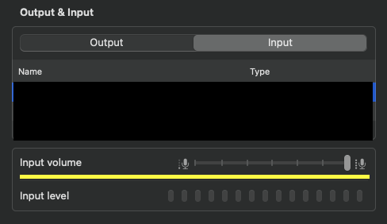

# max-mic-volume

A simple CLI tool to set the microphone volume to the maximum in MacOS.
However, it does not maximize when muted.



## Setup as CLI tool

<https://github.com/amiyzku/max-mic-volume/releases>

## Setup as deamon

```bash
sudo mv max-mic-volume /usr/local/bin/
sudo chmod 755 /usr/local/bin/max-mic-volume

sudo curl -o /Library/LaunchAgents/com.github.amiyzku.max-mic-volume.plist https://raw.githubusercontent.com/amiyzku/max-mic-volume/master/com.github.amiyzku.max-mic-volume.plist
sudo chmod 644 /Library/LaunchAgents/com.github.amiyzku.max-mic-volume.plist

launchctl load /Library/LaunchAgents/com.github.amiyzku.max-mic-volume.plist
```
